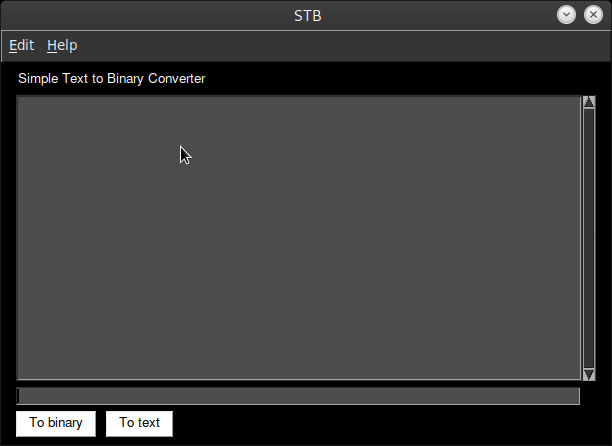
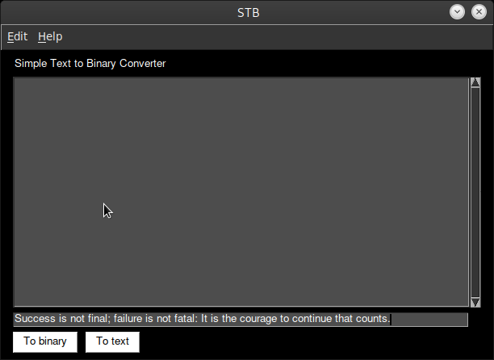
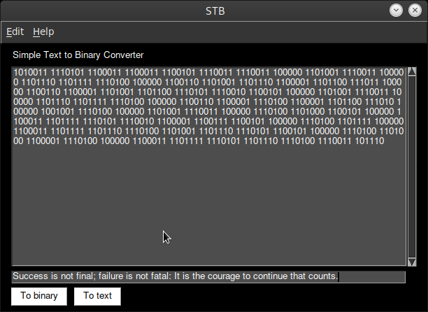
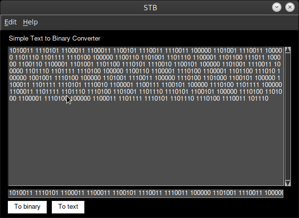
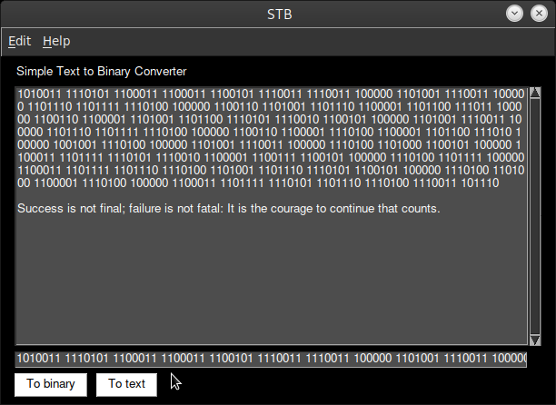

# Stb Simple Text to Binary Converter

Programmed in Python with PySimpleGUI.

Simple text to binary and binary to text converter easy to use. Its convert from
text ascii to binary and from binary to text ascii.

ASCII text encoding uses fixed 1 byte for each character.

UTF-8 text encoding uses variable number of bytes for each character. This requires delimiter between each binary number.

Convert binary ASCII code to text:

Get binary byte
Convert binary byte to decimal
Get character of ASCII code from ASCII table
Continue with next byte

Soon available for websites

# How to use:

Python3+

pip3 install -r requirements.txt

python3 stb.py

# Requriements

PySimpleGUI
pyperclip

# Sample 
---------------------------------------------------------------------------
testing

1110100 1100101 1110011 1110100 1101001 1101110 1100111
---------------------------------------------------------------------------

programing with python

1110000 1110010 1101111 1100111 1110010 1100001 1101101 1101101 1101001 
1101110 1100111 100000 1110111 1101001 1110100 1101000 100000 1110000 
1111001 1110100 1101000 1101111 1101110
---------------------------------------------------------------------------

