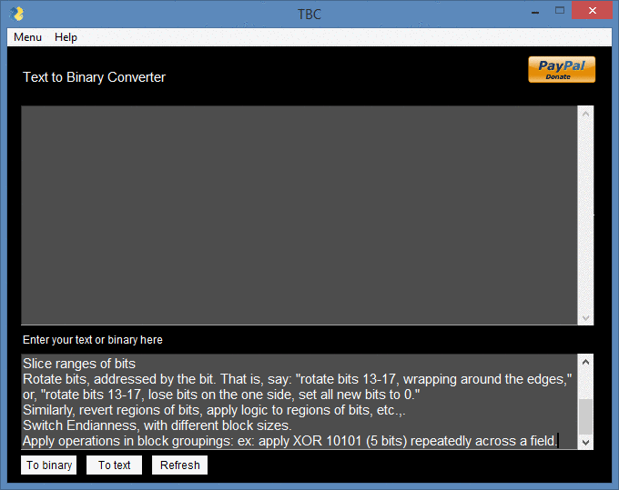

[](https://www.python.org/)

# Text to Binary Converter

[](https://github.com/adrijano/Text-to-Binary-Converter-v1.1/)

[](https://github.com/adrijano/Text-to-Binary-Converter-v1.1/graphs/commit-activity)



[](https://www.paypal.com/donate/?cmd=_s-xclick&hosted_button_id=PFB6A6HLAQHC2&source=url)

**Programmed in Python | PySimpleGUI**

# If you like it give it a star

[](https://github.com/adrijano/Text-to-Binary-Converter-v1.1)


# How it works
```
Simple text to binary and binary to text converter easy to use. Its convert from
text ascii to binary and from binary to text ascii.

ASCII text encoding uses fixed 1 byte for each character.

UTF-8 text encoding uses variable number of bytes for each character. This requires delimiter between each binary number.

Convert binary ASCII code to text:

Get binary byte
Convert binary byte to decimal
Get character of ASCII code from ASCII table
Continue with next byte
```


# How to use

### Python3+
```
git clone https://github.com/adrijano/Text-to-Binary-Converter-v1.1.git

cd Text-to-Binary-Converter-v1.1 && pip install -r requirements.txt

python tbc.py
```

### Windows:
```
cd dist

tbc.exe
```


# Sample 
```
testing

1110100 1100101 1110011 1110100 1101001 1101110 1100111
```

```
programing with python

1110000 1110010 1101111 1100111 1110010 1100001 1101101 1101101 1101001 
1101110 1100111 100000 1110111 1101001 1110100 1101000 100000 1110000 
1111001 1110100 1101000 1101111 1101110
```

## Donations
If you would like to support me, donations are very welcome.

```
You can use Paypal to donate using your own credit card. 
The payment is processed by PayPal but you don't need to have a
PayPal account or sign-up for one if you are paying by credit card.

You can also use your own Paypal account to donate.
```
[](https://www.paypal.com/donate/?cmd=_s-xclick&hosted_button_id=PFB6A6HLAQHC2&source=url)

[](https://github.com/adrijano/Text-to-Binary-Converter-v1.1)


